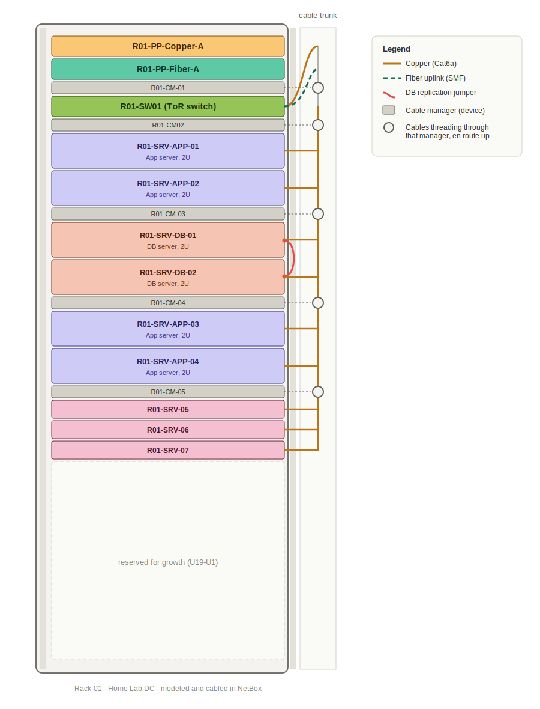
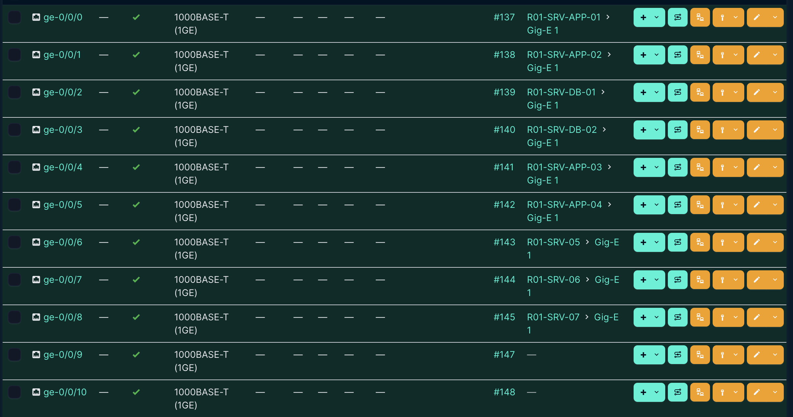
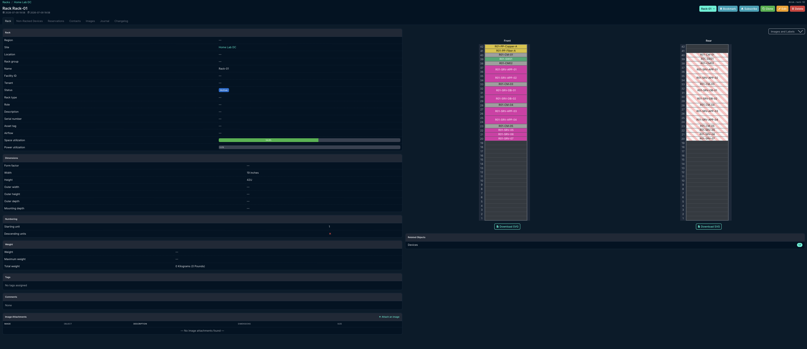

# Rack elevation & cable management lab

A modeled 42U enterprise rack (patch panels, top-of-rack switch, cable
management, and 9 servers across App/DB roles), built and cabled in
[NetBox](https://netboxlabs.com/) — the open-source DCIM (Data Center
Infrastructure Management) tool originally built by DigitalOcean and
widely used across the industry for exactly this kind of rack/cable
documentation.

## Skills demonstrated

- **DCIM tooling** — modeled real rack, device, and cable data in NetBox rather than a static drawing tool
- **Structured cabling standards** — applied TIA-942 rack layout principles and a TIA/EIA-606-style labeling convention
- **Physical network design** — top-of-rack switching, copper vs. fiber uplinks, cable management placement and reasoning
- **Documentation discipline** — port-mapping spreadsheet, labeling scheme doc, and an honest limitations section rather than glossing over shortcuts
- **Attention to real-world detail** — deliberately modeled a direct DB-to-DB replication jumper distinct from switch-routed traffic

## Why NetBox instead of a static diagram

Rather than hand-drawing boxes in a generic diagramming tool, this project
models the rack as real data: real devices, in real rack positions, with
real cable connections between real ports. The rack elevation images
below aren't hand-drawn — they're generated directly from that data,
which means they're accurate by construction and fully traceable (click
any port, see exactly what it connects to).

## Rack layout

| U-position | Device | Role |
|---|---|---|
| U42 | `R01-PP-Copper-A` | Copper patch panel (48-port) |
| U41 | `R01-PP-Fiber-A` | Fiber patch panel (48-port, modeled with copper panel type — see Known limitations) |
| U40 | `R01-CM-01` | Cable manager |
| U39 | `R01-SW01` | Top-of-rack switch (Juniper EX4300-48P) |
| U38 | `R01-CM02` | Cable manager |
| U37-U34 | `R01-SRV-APP-01/02` | App servers (2U each) |
| U33 | `R01-CM-03` | Cable manager |
| U32-U29 | `R01-SRV-DB-01/02` | DB servers (2U each) |
| U28 | `R01-CM-04` | Cable manager |
| U27-U24 | `R01-SRV-APP-03/04` | App servers (2U each) |
| U23 | `R01-CM-05` | Cable manager |
| U22-U20 | `R01-SRV-05/06/07` | Generic 1U servers |
| U19-U1 | — | Reserved for growth |

**Design logic, briefly:**
- Patch panels and the switch sit at the top of the rack for the shortest
  possible cable run from the overhead cable tray to the network layer.
- Cable managers are placed at every group boundary (not just once) so no
  single bundle grows large enough to block airflow or make individual
  cables hard to trace.
- Servers are grouped by role (App together, DB together) rather than by
  arrival order, so related traffic stays physically local and the rack
  is easier to reason about at a glance.

## Cabling

All cabling was built as real, traceable connections in NetBox rather
than described in prose. See [`port-mapping.xlsx`](./port-mapping.md)
for the full table, or the labeling convention in
[`labeling-scheme.md`](./labeling-scheme.md).

**What's connected:**
- Each of the 9 servers' primary NIC (`Gig-E 1`) → a dedicated switch port
- A direct replication jumper between the two DB servers (`Gig-E 2` ↔
  `Gig-E 2`), bypassing the switch entirely — DB servers replicate/cluster
  with each other constantly, so this traffic gets a short direct link
  instead of adding a hop and switch load
- One copper uplink and one fiber uplink from the switch to the patch
  panels, representing the rack's connection out to the building network

## Rack utilization

Currently at ~35% space utilization (26 of 42U used) and 0% power
utilization (power feeds not modeled in this pass) — deliberately left
with headroom rather than packed full, matching how real racks are
provisioned for growth.

## Known limitations / simplifications

Documented honestly rather than glossed over:

- **Fiber patch panel** is modeled using the same 48-port copper patch
  panel device type, since NetBox's default sample data didn't include a
  dedicated fiber panel type. The port-level logic (one port used for the
  uplink) is accurate; the physical port count/style is a stand-in.
- **Switch throughput** is modeled as 1000BASE-T (1GE) per port, matching
  the real spec sheet for the EX4300-48P device type used, rather than
  10GbE as originally planned in the design doc.
- **Fiber uplink cable type** is planned as single-mode fiber (SMF) but
  wasn't finalized as a distinct interface type on the switch in this
  pass — the port-to-port connection exists and is documented, but the
  interface itself is still typed as copper.
- **Single uplinks shown for simplicity.** Production racks typically run
  redundant uplinks (both copper and fiber, sometimes to different
  upstream switches) so a single cable/port failure doesn't take the rack
  offline. This project models one of each to demonstrate the concept.
- **Power distribution (PDUs)** is not modeled as devices in this pass —
  the rack design assumes 0U vertical PDUs on both rear rails, per
  standard practice, but they aren't represented as NetBox objects here.

## Tools used

- [NetBox Cloud (free plan)](https://netboxlabs.com/products/free-netbox-cloud/) — rack, device, and cable modeling
- Python (`openpyxl`) — port-mapping spreadsheet generation
